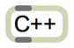

 MaxCpp
==========================


A C++ template single-header file for constructing Max/MSP externals from C++ classes, in a friendly and readable manner. The core notion is that an instance of the external is encapsulated by an instance of the C++ class. Most of the mechanics of typical max objects are encapsulated by the curiously recurring template pattern.

Previously hosted at [Google Code](https://code.google.com/p/maxcpp), updated and tested against Max 6 (2013).

## Using

To develop Max/MSP projects, you will first need the Max SDK, available from [Cycling `74](http://cycling74.com/products/sdk) (also mirrored [on github](https://github.com/Cycling74/max6-sdk))

Since the source files will be C++, the ```main``` function needs to be qualified with ```extern "C"```.

The source trunk includes headers, examples and Xcode project / Visual C++ project files. The example projects should work 'out of the box' if the this repo is placed inside your MaxSDK folder (next to the c74support folder). 

Thanks to Oli Larkin and Thijs Koerselman for feedback and contributions.

Caveats: it almost surely won't work with virtuals or multiple inheritance. Also be careful not to include the header twice, or there'll be linker errors for duplicate m_class symbols.

## Sample code (Max object)

```
#include "maxcpp6.h"

class Example : public MaxCpp6<Example> {
public:
	Example(t_symbol * sym, long ac, t_atom * av) { 
		setupIO(2, 2); // inlets / outlets
	}
	~Example() {}	
	
	// methods:
	void bang(long inlet) { 
		outlet_bang(m_outlets[0]);
	}
	void testfloat(long inlet, double v) { 
		outlet_float(m_outlets[0], v);
	}
	void testint(long inlet, long v) { 
		outlet_int(m_outlets[0], v);
	}
	void test(long inlet, t_symbol * s, long ac, t_atom * av) { 
		outlet_anything(m_outlets[1], gensym("test"), ac, av); 
	}
};

C74_EXPORT extern "C" int main(void) {
	// create a class with the given name:
	Example::makeMaxClass("example");
	REGISTER_METHOD(Example, bang);
	REGISTER_METHOD_FLOAT(Example, testfloat);
	REGISTER_METHOD_LONG(Example, testint);
	REGISTER_METHOD_GIMME(Example, test);
}
```

## Sample code (MSP object)

```
#include "maxcpp6.h"

// inherit from the MSP base class, template-specialized for myself:

class Example : public MspCpp6<Example> {
public:

	Example(t_symbol * sym, long ac, t_atom * av) { 
		setupIO(2, 2); 
	}
	
	~Example() {}	
	
	// methods:
	void bang(long inlet) { 
		post("bang in inlet %i!", inlet); 
	}
	
	void test(long inlet, t_symbol * s, long ac, t_atom * av) { 
		post("%s in inlet %i (%i args)", s->s_name, inlet, ac);
	}
	
	// default signal processing method is called 'perform'
	void perform(double **ins, long numins, double **outs, long numouts, long sampleframes) {
		// example code to invert inputs
		for (long channel = 0; channel < numouts; channel++) {
			double * in = ins[channel];
			double * out = outs[channel];
			for (long i=0; i < sampleframes; i++) {
				out[i] = -in[i];
			}
		}
	}
};

C74_EXPORT extern "C" int main(void) {
	// create a class with the given name:
	Example::makeMaxClass("example~");
	REGISTER_METHOD(Example, bang);
	REGISTER_METHOD_GIMME(Example, test);
}
```

## Licence

maxcpp is distributed under the permissive BSD-like MIT licence:

Copyright (c) 2009-2013 Graham Wakefield

Permission is hereby granted, free of charge, to any person obtaining a copy
of this software and associated documentation files (the "Software"), to deal
in the Software without restriction, including without limitation the rights
to use, copy, modify, merge, publish, distribute, sublicense, and/or sell
copies of the Software, and to permit persons to whom the Software is
furnished to do so, subject to the following conditions:

The above copyright notice and this permission notice shall be included in
all copies or substantial portions of the Software.

THE SOFTWARE IS PROVIDED "AS IS", WITHOUT WARRANTY OF ANY KIND, EXPRESS OR
IMPLIED, INCLUDING BUT NOT LIMITED TO THE WARRANTIES OF MERCHANTABILITY,
FITNESS FOR A PARTICULAR PURPOSE AND NONINFRINGEMENT. IN NO EVENT SHALL THE
AUTHORS OR COPYRIGHT HOLDERS BE LIABLE FOR ANY CLAIM, DAMAGES OR OTHER
LIABILITY, WHETHER IN AN ACTION OF CONTRACT, TORT OR OTHERWISE, ARISING FROM,
OUT OF OR IN CONNECTION WITH THE SOFTWARE OR THE USE OR OTHER DEALINGS IN
THE SOFTWARE.